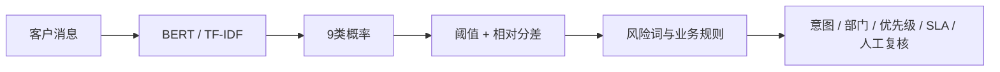

# 电商客户诉求多标签识别与智能工单路由系统

[](https://github.com/wangjie2617-glitch/ecommerce-intent-routing/actions/workflows/ci.yml)
[](https://www.python.org/)
[](LICENSE)

一个面向电商客服场景的NLP工程项目：从客服消息中识别多个业务意图，并结合模型置信度与风险规则，输出处理部门、优先级、SLA和人工复核建议。

> 数据为可复现模板合成，不包含真实客户数据。所有指标只代表当前合成测试集，不能等同生产效果。

## 项目亮点

- 9类多标签分类，支持“物流异常 + 退款退货”等复合诉求；
- TF-IDF + Logistic Regression基线与轻量中文BERT完整对比；
- 验证集逐标签阈值调优，而非统一使用0.5；
- 绝对阈值、相对分差、显式意图词和高风险词共同决策；
- 自动输出部门、优先级、SLA、转人工标志与解释原因；
- BERT优先加载，产物缺失时自动回退TF-IDF；
- FastAPI单条/批量接口、Swagger和浏览器演示页；
- 自动化测试、Docker、评估报告和架构文档齐全。

## 业务标签

| 意图 | 默认部门 | 优先级 | SLA |
|---|---|---|---:|
| 商品咨询 | 售前客服 | low | 30分钟 |
| 退款退货 | 售后客服 | medium | 20分钟 |
| 物流异常 | 物流客服 | medium | 20分钟 |
| 商品质量 | 质量售后 | high | 10分钟 |
| 支付问题 | 支付支持 | high | 10分钟 |
| 优惠活动 | 营销客服 | low | 30分钟 |
| 账号问题 | 账户安全 | high | 10分钟 |
| 投诉升级 | 客诉专员 | urgent | 5分钟 |
| 其他问题 | 综合客服 | medium | 30分钟 |

## 模型效果

测试集包含300条独立表达，其中133条是多诉求消息。

| 模型 | Micro-F1 | Macro-F1 | Samples-F1 | Exact Match | Hamming Loss |
|---|---:|---:|---:|---:|---:|
| TF-IDF + LR | 0.5971 | 0.5890 | 0.5691 | **0.3800** | **0.1344** |
| 轻量中文BERT | **0.6588** | **0.6685** | **0.6544** | 0.2733 | 0.1389 |

BERT的Macro-F1高7.95个百分点，因此作为默认模型；完整分析见[模型对比报告](reports/model_comparison.md)。

## 系统流程



详细架构见[架构文档](docs/architecture.md)。

## 快速运行（Windows）

克隆仓库并进入项目目录：

```powershell
git clone https://github.com/wangjie2617-glitch/ecommerce-intent-routing.git
cd ecommerce-intent-routing
```

如果本地已经完成环境配置和模型训练，可直接启动：

```powershell
.\scripts\run.ps1
```

浏览器访问：

- 演示页面：http://127.0.0.1:8000/
- Swagger：http://127.0.0.1:8000/docs
- 健康检查：http://127.0.0.1:8000/health

全新环境使用：

```powershell
.\scripts\setup.ps1
.\.venv\Scripts\python.exe scripts\train_all.py
.\scripts\run.ps1
```

## API示例

单条预测：

```powershell
$body = @{ text = "快递一周没更新，我不想等了，帮我退款" } | ConvertTo-Json
Invoke-RestMethod -Method Post -Uri "http://127.0.0.1:8000/api/v1/predict" -ContentType "application/json" -Body $body
```

批量预测：

```powershell
$body = @{ texts = @("付款成功为什么还是待支付", "电子发票在哪里下载") } | ConvertTo-Json
Invoke-RestMethod -Method Post -Uri "http://127.0.0.1:8000/api/v1/predict/batch" -ContentType "application/json" -Body $body
```

响应结构：

```json
{
  "text": "快递一周没更新，我不想等了，帮我退款",
  "intents": [
    {"label": "退款退货", "score": 0.6544},
    {"label": "物流异常", "score": 0.5132}
  ],
  "route": {
    "department": "售后客服",
    "priority": "medium",
    "sla_minutes": 20,
    "manual_review": false,
    "reasons": ["识别到多重诉求：退款退货, 物流异常"]
  },
  "model_type": "lightweight-chinese-bert",
  "latency_ms": 1.45
}
```

## 重新训练

一次运行全部流程：

```powershell
.\.venv\Scripts\python.exe scripts\train_all.py
```

分步骤运行：

```powershell
.\.venv\Scripts\python.exe -m ml.data_generator
.\.venv\Scripts\python.exe -m ml.train_baseline
.\.venv\Scripts\python.exe -m ml.train_bert --epochs 10 --batch-size 32 --learning-rate 0.0001
```

## 自动化测试

```powershell
.\.venv\Scripts\python.exe -m pytest
```

测试覆盖数据生成可复现性、多标签路由、低置信度转人工、高风险升级、敏感标签保护和API契约。

## 项目结构

```text
├── app/                    # API、推理服务、业务路由、演示页面
├── ml/                     # 数据生成、基线、BERT与评估工具
├── scripts/                # 环境、训练和启动脚本
├── tests/                  # 自动化测试
├── data/                   # 原始示例与生成后的数据
├── artifacts/              # 基线和BERT模型产物
├── reports/                # JSON/Markdown指标与混淆矩阵
├── docs/                   # 架构与数据声明
├── Dockerfile
└── docker-compose.yml
```

## 关键技术决策

1. **为什么保留传统模型**：训练与推理速度快，作为判断BERT增益的可信基线。
2. **为什么不是单标签**：真实咨询经常同时包含物流、退款和投诉等多个诉求。
3. **为什么加入规则层**：模型分数不能直接等同部门和SLA，敏感误报需要业务保护。
4. **为什么使用合成数据**：真实客服语料涉及隐私和商业授权，个人项目必须明确边界。
5. **为什么使用轻量BERT**：在一天交付和普通电脑条件下平衡训练速度、效果与可复现性。

## 限制

- 合成数据覆盖的表达和噪声有限；
- 当前没有真实客服对话上下文；
- 路由规则由项目假设制定，尚未经过企业业务人员验收；
- 正式上线前需要真实脱敏数据、标注规范、漂移监控和灰度验证。

## 预训练模型来源

项目使用公开的[`uer/chinese_roberta_L-2_H-128`](https://huggingface.co/uer/chinese_roberta_L-2_H-128)轻量中文BERT检查点，项目数据和结果不代表该模型发布方。
