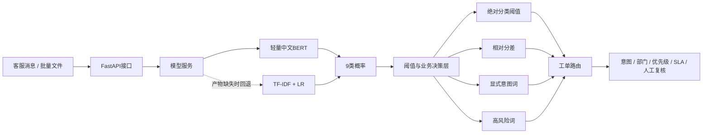
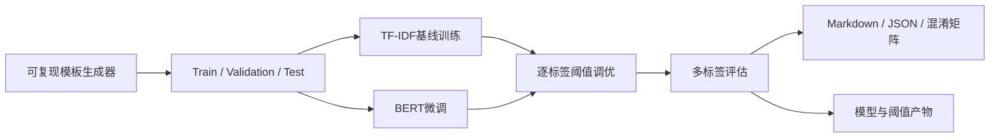

# 系统架构

## 离线训练链路

## 核心设计

1. **模型和规则分层**：模型只输出概率，部门、SLA和人工复核由可解释业务规则决定。
2. **双模型回退**：优先加载BERT，产物不存在时自动使用TF-IDF模型。
3. **多标签阈值**：每个类别在验证集上单独调节阈值，避免统一0.5造成类别偏差。
4. **敏感类别保护**：账号与投诉类别设置更高绝对阈值；高风险词强制转人工。
5. **通用接口**：单条与批量API使用一致响应结构，方便后续RAG Agent调用。

